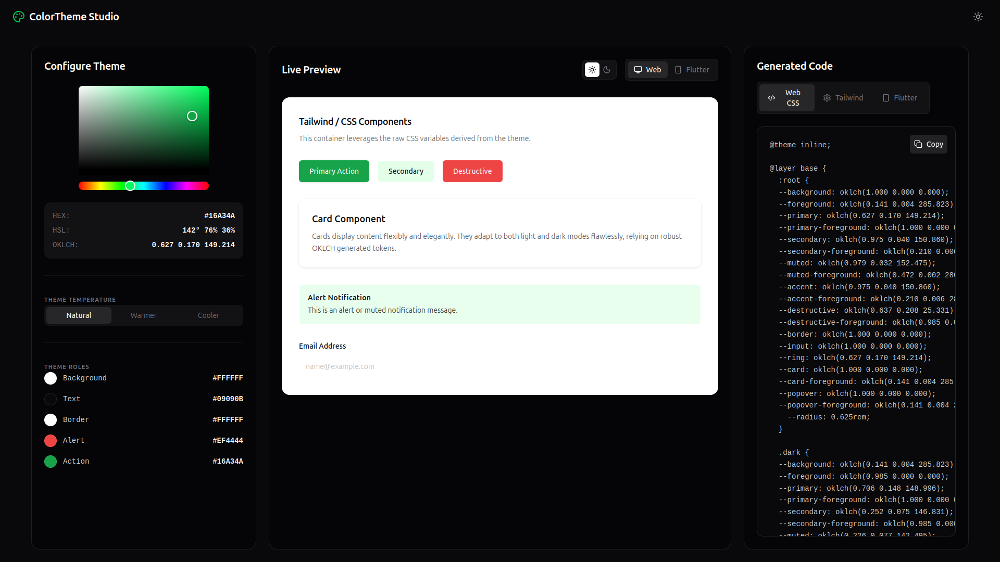
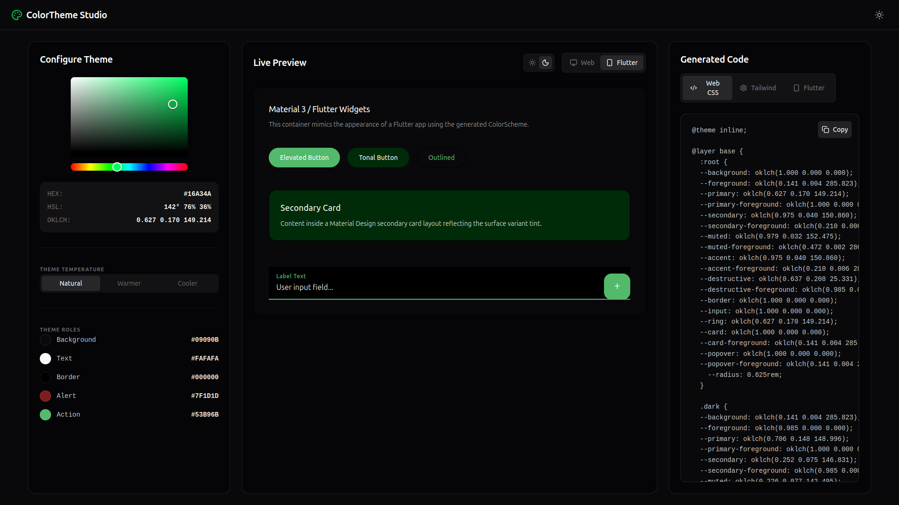
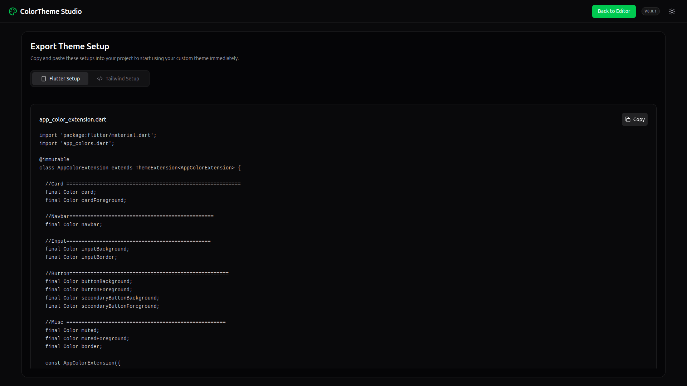
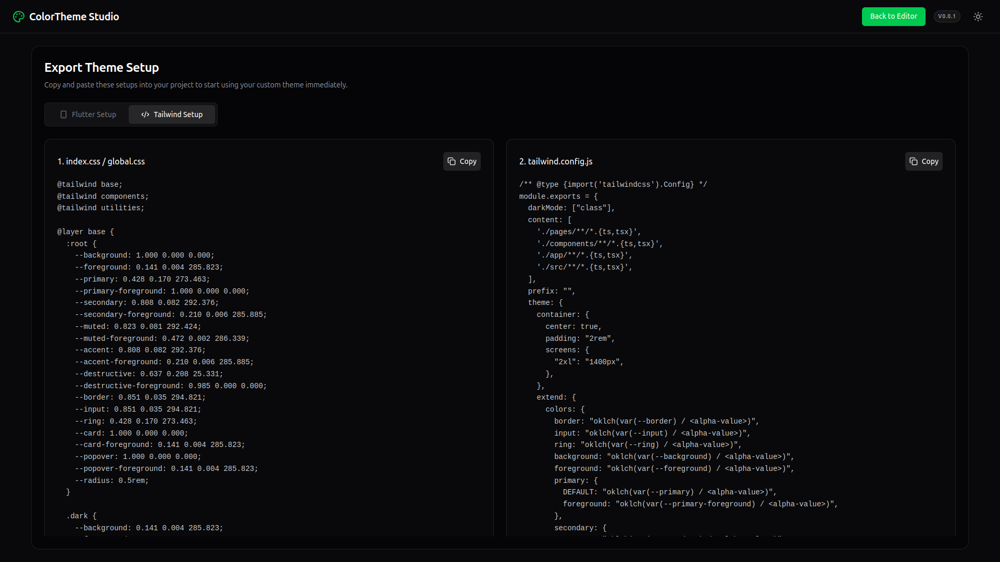

# ColorTheme Studio

ColorTheme Studio is a powerful, elegant, and developer-friendly color theme generator. It allows designers and developers to create, customize, and preview comprehensive color palettes, and seamlessly export them to modern frameworks like Tailwind CSS and Flutter.

## 🚀 Features

- **Intuitive Color Generation:** Pick a base color and automatically generate a harmonious, accessible color palette.
- **Theme Temperature Adjustment:** Fine-tune your theme's feel by adjusting between natural, warmer, and cooler variations.
- **Real-Time Preview:** Instantly see how your generated theme looks in both Web (Tailwind component) and Mobile (Flutter component) contexts.
- **Dark & Light Modes:** Comprehensive support for both light and dark mode versions of your generated themes.
- **One-Click Code Export:** Easily transition from design to development with a dedicated "Export Setup" page providing:
  - Full modern Tailwind CSS configurations (`tailwind.config.js`)
  - Native Web CSS Variables (`:root` definitions)
  - Complete Flutter themes generated across 9 comprehensive Dart files mirroring professional app setups.

## 📸 Screenshots

### Web & Tailwind CSS Preview

### Flutter Preview

### Export Setup

## 📖 Documentation

To understand the core project workings and how different pieces fit together, please refer to our documentation directory:

- [explain.md](./docs/explain.md) - Detailed explanation of the project capabilities and usage.
- [architecture.md](./docs/architecture.md) - Deep dive into the component architecture, state management, and file structure.
- [components.md](./docs/components.md) - New Components customization feature (typography, geometry, live previews).
- [file-structure.md](./docs/file-structure.md) - Detailed per-file responsibilities.
- [getting-started.md](./docs/getting-started.md) - How to run and test the project locally.

## 🚀 Recent Developments

- **Components Customization:** Dedicated page with typography/geometry controls, **Preset Styles** (12 pro presets, click-toggle dropdown), random styles, live previews for buttons/inputs/cards.
- Progress tracked in [TODO.md](./TODO.md).

## 🔗 Live Demo

Visit the live website here: [https://colorthemestudio.vercel.app/](https://colorthemestudio.vercel.app/)

## 🛠️ Tech Stack

- **Framework:** React + Vite
- **Styling:** Tailwind CSS, ShadCN UI
- **Icons:** Lucide React
- **State Management:** Zustand
- **Color Manipulation:** culori, chroma-js
